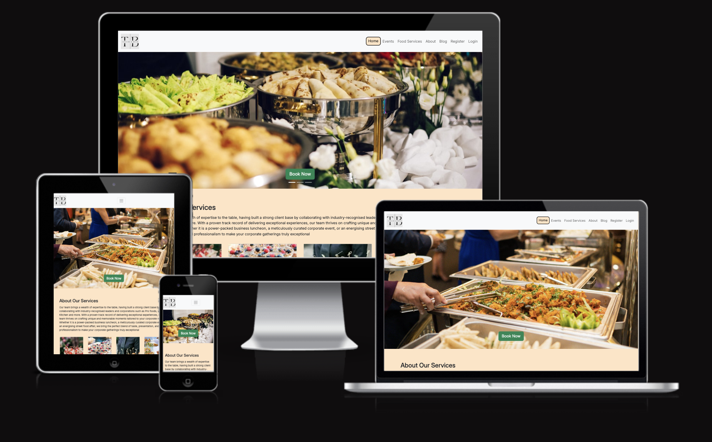

# Touch and Bite Catering Services | Blog

(Developer: Morgan Asare)

[Link to the website](https://touch-and-bite-b5dacde13c2d.herokuapp.com/)

## Table of Content

1. [Project Goals](#project-goals)
    1. [About](#about)
    2. [User Goals](#user-goals)
    3. [Site Owner Goals](#site-owner-goals)
    4. [User Stories](#user-stories)
       -[Admin User Stories](#admin-user-stories)
    6. [Design](#design)
      - [Colour Scheme](#colours)
      - [Fonts](#fonts)
      - [Structure](#structure)
        - [Website pages](#website-pages)
        - [Database](#database)
      - [Wireframes](#wireframes)
3. [User Experience](#user-experience)
    1. [Target Audience](#target-audience)
    2. [User Requirements and Expectations](#user-requrements-and-expectations)
4. [Technologies Used](#technologies-used)
    1. [Languages](#languages)
    2. [Frameworks & Tools](#frameworks-&-tools)
5. [Features](#features)
6. [Testing](#validation)
    - [Application Testing](#performing-tests-on-various-devices)
    - [Manual testing](#manual-testing)
    - [Automated testing](#automated-testing)
    - [Tests on various devices](#tests-on-various-devices)
    - [Browser compatibility](#browser-compatibility)
7. [Validation](#validation)
8. [Bugs](#Bugs)
9. [Heroku Deployment](#deployment)
10. [Credits](#credits)
11. [Acknowledgements](#acknowledgements)

### Touch and Bite catering services is a fictional business set up to complete PP4. In this project, a user can book services from the company by creating an account and reserving a date with food details and the number of guests.

### User Goals

- To create a user account
- To pre-book a catering service
- To view menu, a blog, and contact information

### Site Owner Goals

- To create a web application to allow users to book catering service
- To make the web application appealing to attract business
- Implement modern technologies to enhance user experience
- Implement a fully responsive web application

### User Stories

1. As a User I can navigate across the site to move to each feature of the site easily. (Must have)
2. As a User I can use a navbar, footer, and social icons to navigate the site, access menus, and access socials. (Must have)
3. As a Site Owner I can provide a Contact Us page so that users can get in touch with my business (Must have)
4. As a User I can view the opening hours and contact details so that I know when the business is open and how to contact them via email, phone and socials (Must have)
5. As a User I can create a booking by selecting a date and time. (Must have)
6. As a User I can update my booking so that I can choose another available time and date slot. (Must have)
7. As a User I can delete my booking so that I can cancel the reservation (Must have)
8. As a user I can view my booking so that I can remind myself of the date and time I have booked (Must have)
9. As a User I can be notified so that I know my action of creation, edit, or deletion of a booking has been successful (Must have)
10. As a User I can register as prompted so that I can make a booking if I wish to reserve a table. (Must have)
11. As a User I can register to create an account so that my details are stored for faster booking in the future (Must have)
12. As a user I can log in so that I can book a table (Must have)
13. As a user I can see my login status so that I know if I am logged in or not (Must have)
14. As a User I can view the site's blog so that I can learn additional information and read articles (Should have)
15. As a User I can view the food menu so that I can decide whether to eat at the business. (Must have)
16. As a User I can not book a date in the past so that my booking is valid (Must have)
17. As a User, I can view blog posts page by page so that I can browse without seeing an overloaded page (Should have)
18. As a User I can not book a table already booked so that my booking is valid and not double booked (Must have)

### Admin User Stories

1.	As an Admin / Authorised User I can log in so that I can access the back end of the site (Must have)
2. As an Admin / Authorised User I can toggle booking confirmation to auto or manual mode so that on busy days manual mode can be used to reduce double bookings. (Must have)
3.	As an Admin / Authorised User I can manually add a booking so that I can book a table if someone phones, or emails the business (Should have)
4. As an Admin / Authorised User I can accept or reject bookings so that we avoid double bookings (Must have)
5. As an Admin I can log in to add or remove items from the food and cocktail menu so that we can add more food and drinks or remove them. (Must have)
6.	As an Admin I can create, read, update, and delete food and drinks items from the database so that we can add, remove, rename, and view all our food and drinks items (Must have)
7. As an Admin / Authorised User I can search through bookings and menus so that I can find the information I am looking for	 (Should have)
8. As an Admin / Authorised User I can filter bookings by date so that I can see what bookings we have for a particular day (Should have)

### Site Owner 

1. As a Site Owner I can provide a fully responsive site for my customers so that they have a good user experience. (Must have)
2. As a Site Owner I can validate data entered into my site so that all submitted data is correct to avoid errors (Must have)

### Kanban, Epics & User Stories

- GitHub Kanban was used to track all open user stories
- Epics were created using the milestones feature
- Backlog, In Progress, Done headings were used in the kanban

### Epics

### User Stories

### Kanban
  

## Design

### Colour Scheme

### Fonts 
The fonts selected for this project were from Google Fonts; Poppins, Inter and sans-serif as a backup font.

### Structure

#### Website pages
The site was designed for the user to be familiar with the layout such as a navigation bar along the top of the pages and a hamburger menu button for smaller screen.

The footer contains all relevant social media links that the business has so the user can visit any social media site and follow the business there to expand the businesses followers, likes and shares.

- The site consists of the following pages:
  - Homepage with courosel and booking button for the user to book for a preferred service.
  - Food menu has the current list of all available foods from the database sorted by starters, mains and desserts
  - Drinks menu has the current list of all available drinks from the databse sorted by type
  - Blog page has a paginated list of blogs posted by an admin or authorised user, 4 per page
  - Blog expanded displays a blog the user has selected so they can read the blog, if they are logged in they can also leave a comment which will then need to be approved before it is displayed
  - Book page allows registered users to book a service , guest count, date requested, time requested and table location
  - My bookings displays all bookings for the user that they have made, bookings in the past are automatically expired
  - Edit booking allows the user to change their date, time, table and guest count
  - Cancel booking allows the user to cancel the booking which will then delete it from the database
  - Contact us allows the user to send us a DM if the are registered, or they can contact us from the displayed email and phone number or visit the address listed.
  - Once registered, users can comment on a blog they have read. they can also edit and delete a previous comment.
  - Login / Logout allows users to login to make bookings, view, edit, and delete bookings
  - Register allows the user to regiser so they can use the booking system
  - 404 error page to display if a 404 error is raised

#### Database

- Built with Python and the Django framework with a database of a Postgres for the deployed Heroku version(production)
- Two database model shows all the fields stored in the database

##### User Model
The User Model contains the following:
- user_id
- password
- last_login
- is_superuser
- username
- first_name
- last_name
- is_active
- date_joined

##### FoodItem Model
The FoodItem Model contains the following:
- food_id
- food_name
- description
- price
- available

##### DrinkItem Model
The DrinkItem Model contains the following:
- drink_id
- drink_name
- description
- price
- available

##### Table Model
The Table Model contains the following:
- table_id (PrimaryKey)
- table_name
- max_seats
- available

##### Booking Model
The Booking Model contains the following:
- booking_id (PrimaryKey)
- created_date
- requested_date
- requested_time
- table (ForeignKey)
- guest (ForeignKey)
- seats
- guest_count

##### Post Model
The Post Model contains the following:
- title
- post_id (PrimaryKey)
- author (ForeignKey)
- created_date
- updated_date
- content
- featured_image
- excerpt
- slug
- status

##### Comment Model
The Comment Model contains the following:
- post (ForeignKey)
- name
- email
- body
- created_date
- approved
- Meta: created_on

##### ContactUs Model
The ContactUs Model contains the following:
- contact_id (PrimaryKey)
- name (ForeignKey)
- email (ForeignKey)
- phone (ForeignKey)
- body

### Wireframes
The wireframes were created using Miro

## Technologies Used

### Languages & Frameworks

- HTML
- CSS
- Javascript
- Python
- Django

### Libraries & Tools

- [Am I Responsive](http://ami.responsivedesign.is/)
- [Miro](https://miro.com/)
- [Bootstrap v5.2](https://getbootstrap.com/)
- [Cloudinary](https://cloudinary.com/)
- [Favicon.io](https://favicon.io)
- [Chrome dev tools](https://developers.google.com/web/tools/chrome-devtools/)
- [Font Awesome](https://fontawesome.com/)
- [Git](https://git-scm.com/)
- [GitHub](https://github.com/)
- [Google Fonts](https://fonts.google.com/)
- [Heroku Platform](https://id.heroku.com/login)
- [Postgres](https://www.postgresql.org/)
- [Summernote](https://summernote.org/)
- Validation:
  - [WC3 Validator](https://validator.w3.org/)
  - [Jigsaw W3 Validator](https://jigsaw.w3.org/css-validator/)
  - [JShint](https://jshint.com/)
  - [Pycodestyle(PEP8)](https://pypi.org/project/pycodestyle/)
  - [Lighthouse](https://developers.google.com/web/tools/lighthouse/)
  - [Wave Validator](https://wave.webaim.org/)

##### Back to [top](#table-of-contents)

## Features

### Home page
- Home page includes nav bar, main body and a footer

### Logo & Navigation
- Custom logo for the business
- Fully Responsive
- On small screens switches to hamburger menu
- Indicates login/logout in status
- displayed on all pages

#### Logged Out NavBar

## Credits

- Some of the code was borrowed from [I Think Therefore I Blog]
- Code reference to [Arron Beale](https://ci-pp4-the-diplomat.herokuapp.com/)
- Code  reference to [EastStr](https://east-street-bc0671035c95.herokuapp.com/)
- Also, regex for validating passwords was borrowed from [Tutorialspoint](https://www.tutorialspoint.com/password-validation-in-python)
- Stackoverflow
- ChatGPT

### Content
- Some of the contents were generated from ChatGPT
- [W3 Schools](https://validator.w3.org/nu/)
- [Stack Overflow](https://validator.w3.org/nu/)

## Acknowledgements

### Special thanks to the following:
- Code Institute
- My Mentor Mo Shami
- My Wife
- Gabriel who helped me on the journey
